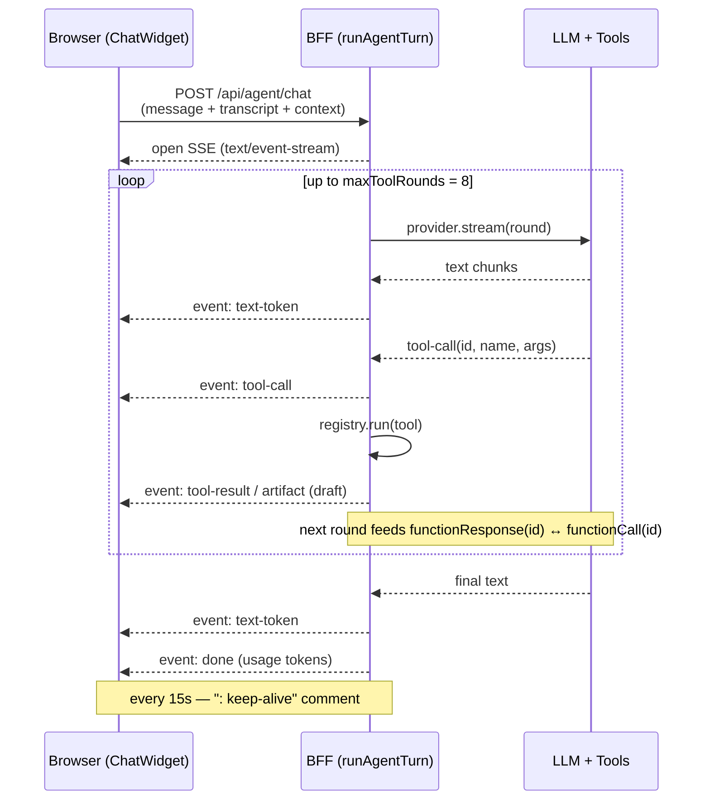
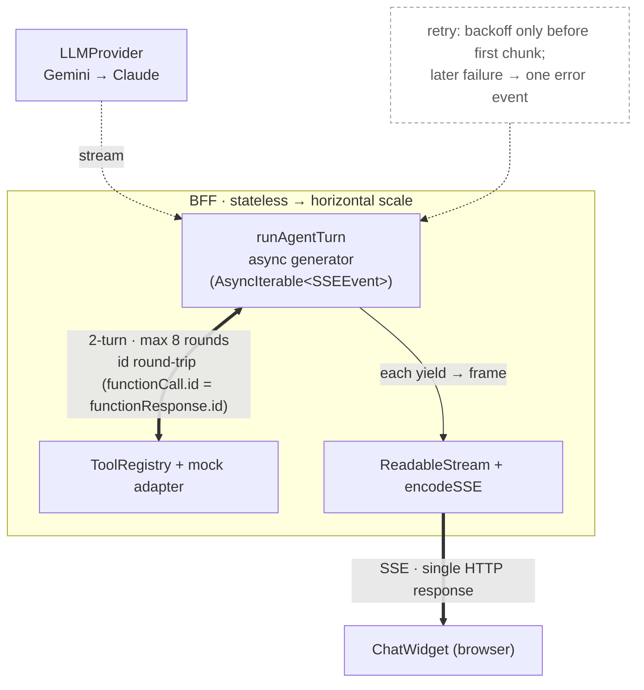

# BFF & SSE — how a turn works under the hood

> **SSOT** for the agent transport architecture. The in-app **System Guide** page
> (`features/guide`) is the *visual* presentation of this doc — keep them in sync; this
> file wins. Audience: developers setting up a sustainable, scale-up-ready architecture.
> **구현 상태(날짜별):** [`../STATUS.md`](../STATUS.md) — 이 문서는 *timeless* SSOT(무엇을/왜); "어디까지 됐나"는 STATUS.

## What the BFF is

The SvelteKit Node server (adapter-node) is a **Backend-for-Frontend**: it holds the LLM
key, runs the agent loop, and streams results. It is **stateless** — no server-side
session; the client sends the full transcript on every request, so any instance can serve
any turn. The only future backend role is the Kotlin **AI-agent connection path**, wired
last; today asset reads resolve against the **live catalog the client sends in `context`
each turn** (seeded from the **host-owned mock** at `lib/server/mock`, served by `/api/assets`;
the agent-core tools carry **no seed of their own**), and saves persist to **IndexedDB** (client).

> **Conversations are client-persisted too.** The BFF stores no conversation — the client
> keeps the transcript and saves it to IndexedDB (`conversations.store`), so a chat resumes by
> replaying that transcript into a fresh stateless request. This is what powers the **AI 대화
> 기록** page and the FAB sharing one history. See [`chat-history.md`](chat-history.md). When the
> AI-connection backend lands, server-side transcript storage is the swap point (see §scale notes).

## Transport: POST in, SSE out (not WebSocket)

A turn is **one long-lived HTTP response**. The client POSTs a `ChatRequest`; the server
opens a `text/event-stream` and pushes ordered frames until `done`.

- **Request** (`POST /api/agent/chat`, `ChatRequest`): `{ conversationId, message, transcript[], context, clientTurnId }`. `clientTurnId` is the client's idempotency key. `context` rides the client's live state: `catalog` (compact id/name/level/type index of all assets), `focusedDetails` (full detail incl. BPMN `xml` for the active/selected assets), and `activeAssetRef`.
- **Response headers**: `Content-Type: text/event-stream`, `Cache-Control: no-cache`, `X-Accel-Buffering: no` (disables nginx response buffering — critical for streaming).
- **Frame format** — `event: <name>\ndata: <json>\n\n` (blank line ends a frame).
- **Events** (`SSEEvent` union in `@repo/agent-types`): `text-token` · `tool-call` · `tool-result` · `artifact` · `error` · `done`. (`thinking` exists in the union but is **reserved** — the loop does not emit it yet.)
- **Keep-alive**: a `: keep-alive\n\n` comment every **15 s** prevents proxy/browser idle timeouts.

## Sequence (one turn)

> Rendered by GitHub and most slide tools. Edit the text below to change the diagram.

## Data flow (under the hood)

## Under the hood

- **`runAgentTurn` is an async generator** (`AsyncIterable<SSEEvent>`, in `@repo/agent-core`). The `+server.ts` route adapts it into a `ReadableStream`, encoding each yielded event with `encodeSSE` and enqueueing the frame. Backpressure is the stream's.
- **Two-turn function-calling.** Each round: the model streams text and/or tool-calls; the loop runs the called tools via the `ToolRegistry`, emits their `tool-result`/`artifact`, then feeds the results back for the next round — until the model stops calling tools or `maxToolRounds` is hit (loop default **4**; the chat route sets **8** so context lookups like `get_asset`/`search_assets` don't starve the action step).
- **Tool error / repair contract (uniform).** Every tool **throws** on bad input or invalid output; the loop catches it, records the failure in the registry's error stats, and emits `tool-result {ok:false, summary}`. The model reads that summary and self-corrects in a later round — e.g. `draw_bpmn`/`update_bpmn` reject malformed XML ("fix and call again"), `create_task` rejects a missing process. No tool returns a soft `{valid:false}` that the loop would record as success. The valid route ids for `navigate_to` are injected as **data** from `APP_ROUTES` (`src/lib/routes.ts`), kept in sync with the sidebar by `routes.test.ts`.
- **Context seam (client state rides each turn).** `get_asset`/`search_assets` resolve **only** against `context.catalog` / `context.focusedDetails` (the user's live assets, including ones created in-session) — the agent-core tools carry **no seed of their own** (no catalog ⇒ no hits), which keeps them portable to `automation`. The governance demo's asset seed is host-owned (`src/lib/server/mock/assets.ts`, served by `/api/assets`, hydrated into the client store → rides back as `context.catalog`). A compact **preamble** built from `context` (the active asset + "이 자산/이 프로세스" guidance) is prepended to the system prompt, so the focused asset reaches the *model*, not just the tools. The future backend replaces this seam (server reads its own store instead of `context`).
- **id round-trip contract (critical).** The provider mints a `crypto.randomUUID()` id per tool-call. The loop reuses that exact id for the `tool-call` event, the appended assistant `Message.toolCalls[i].id`, and the `functionResponse(id)` fed to the next round — so Gemini sees matching `functionCall(id)`/`functionResponse(id)` pairs.
- **Retry policy.** `withBackoff` retries a round **only before its first chunk is consumed** (max 3 retries / 4 attempts). Once ≥1 chunk has streamed, a later throw is **not** retried (that would replay already-sent frames) — it surfaces as a single `error` event (`recoverable:true`) and the turn ends.
- **Errors.** Malformed request → `400` + an `error` SSE frame (so the client's parser still reads it). Provider quota/overload → `error` with `retryAfterSeconds`.

## Sustainable / scale-up notes

- **Stateless → horizontal scale.** No sticky sessions; run N replicas behind nginx. Full transcript per request is the trade-off (bandwidth for statelessness) — fine at current scale; revisit with server-side transcript storage only if payloads grow.
- **SSE proxying.** It's a single long response, so the proxy must **not buffer** (`X-Accel-Buffering: no`) and needs a **long read timeout**; nginx is configured this way. No WebSocket upgrade needed.
- **Model swap behind `LLMProvider`.** Gemini now, Claude later — a config change (`PA_AGENT_PROVIDER`/`PA_AGENT_MODEL`); no vendor SDK/model id leaks outside `lib/server/llm/`. Key is runtime-only env.
- **Cost & limits.** `rpmLimit` (client) caps request rate; provider limits surface as retryable `error` events; per-turn token usage rides the `done` event for metering.
- **Tools as data.** The registry (`{name, description, enabled, schema, run}` + counters) lets an admin enable/disable/inspect tools with no code change.

## Key files

| Concern | File |
|---|---|
| SSE route (POST → stream) | `apps/process-governance/src/routes/api/agent/chat/+server.ts` |
| Agent loop (generator) | `packages/agent-core/src/agent/loop.ts` (`runAgentTurn`) |
| SSE encoding / keep-alive | `packages/agent-core/src/sse.ts` |
| Runtime assembly + docs | `apps/process-governance/src/lib/server/agent.ts` |
| Event/payload types | `packages/agent-types/src/index.ts` (`SSEEvent`, `Artifact`, `ChatRequest`) |
| Client consumer | `packages/agent-ui/src/client/sse-client.ts` |
| LLM provider abstraction | `packages/agent-core/src/llm/` (`provider.ts`, `gemini.ts`) |
